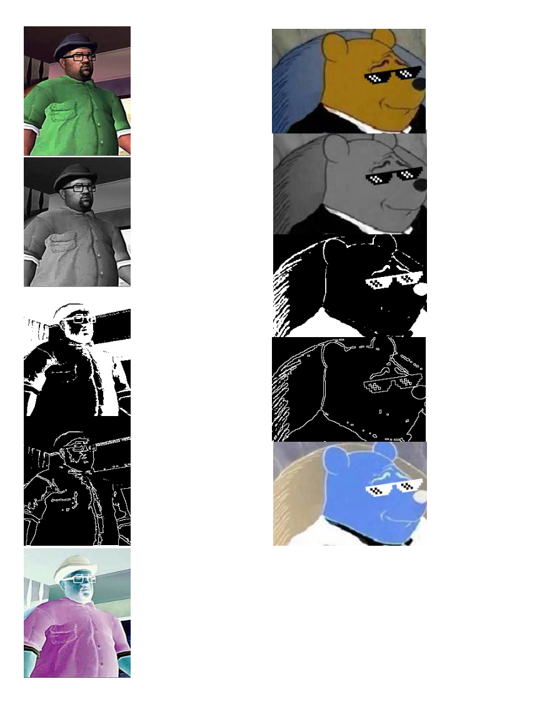
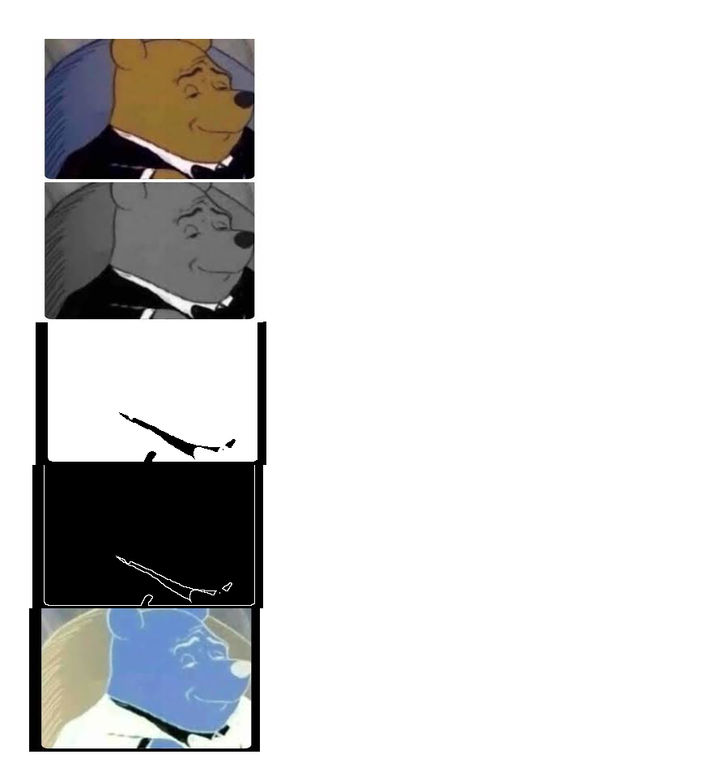

 # Imagen para meme

 

 Esta aplicación de procesamiento de imágenes esta inspirado en [este video.](https://youtu.be/l58EHF5sCwk?t=78) Además usa código del repositorio **pdi**. 

Para compilar y ejecutar el código se usan las siguientes instrucciones:
 ```
 g++ mainImagenParaMeme.cpp otsu.cpp otsu.h pdiMorfologicas.cpp pdiMorfologicas.h pdiImagenNegativa.cpp pdiImagenNegativa.h   -o mainImagenParaMeme `pkg-config --cflags --libs opencv`

./mainImagenParaMeme nombreDeLaImagen.extencion nombreDeLaImagen
 ```

## Observaciones

### Observación 1

Puede haber imágenes para las que el resultado no sea el deseado por la naturaleza de la imagen.
A continuación se muestra un ejemplo, en este caso el resultado se debe a que la imagen original tiene un marco de color blanco.



### Observación 2

No se genera la *plantilla para el meme*, lo que se genera son las imágenes por separado.
