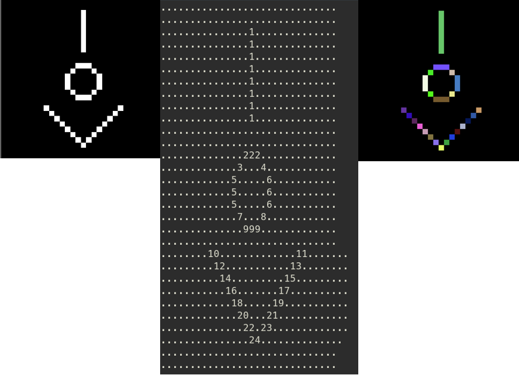
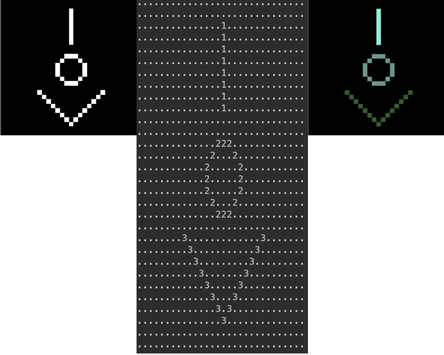

# pdiBlobColoring





Es el algoritmo *blob coloring*, también conocido como [*conected component labeling*](https://en.wikipedia.org/wiki/Connected-component_labeling), consiste en detectar regiones conectadas en imágenes binarias. En este código se usó [OpenCV](https://opencv.org/).

Este algoritmo recorre toda la imagen con una ventana que indica los vecinos del pixel actual en la imagen binaria, esta ventana cambia dependiendo que pixeles son considerados como vecinos del pixel actual, en los casos aquí mostrados, para *4-vecinos* la ventana es:


Y para *8-vecinos* la ventana es:


## Descripción breve de las funciones

### pdiBlobColoring4Vecinos

Esta función esta declarada como:

`int pdiBlobColoring4Vecinos (Mat imagen, Mat regiones)`

donde:

* `Mat imagen` es una **imagen binaria** abierta en escala de grises donde el color blanco esta representado con 255 y negro con 0.

* `Mat regiones` es una una imagen del mismo tamaño que `Mat imagen` pero tiene que ser de 32 bits para codificar los números (posiblemente mayores a 255) que se almacenan. Esta imagen se usa como el tablero de regiones.

Para crear `Mat regiones` de 32 bits del mismo tamaño que `Mat imagen` se puede hacer lo siguiente:

```c++
Mat imagen = imread(argv[1], 0); // abre gris

Mat imagen(imagen.size(), CV_32S); //crea un Mat con el tamaño de imagen pero usa 32bits en lugar de 8bits
```

La función `int pdiBlobColoring4Vecinos (Mat imagen, Mat regiones)` retorna un número entero que es el total de regiones, en este caso el fondo, que corresponde al color negro se considera como región.

### pdiBlobColoring8Vecinos

Esta función esta declarada como:

`int pdiBlobColoring8Vecinos(Mat imagen, Mat regiones)`

donde:

* `Mat imagen` es una **imagen binaria** abierta en escala de grises donde el color blanco esta representado con 255 y negro con 0.

* `Mat regiones` es una una imagen del mismo tamaño que `Mat imagen` pero tiene que ser de 32 bits para codificar los números (posiblemente mayores a 255) que se almacenan. Esta imagen se usa como el tablero de regiones.

Para crear `Mat regiones` de 32 bits del mismo tamaño que `Mat imagen` se puede hacer lo siguiente:

```c++
Mat imagen = imread(argv[1], 0);// abre gris

Mat imagen(imagen.size(), CV_32S);//crea un Mat con el tamaño de imagen pero usa 32bits en lugar de 8bits
```

La función `int pdiBlobColoring8Vecinos(Mat imagen, Mat regiones)` retorna un número entero que es el total de regiones, en este caso el fondo, que corresponde al color negro se considera como región.

### pdiColorearRegiones

Esta función esta declarada como:

`void pdiColorearRegiones(Mat regiones, int totalColores, char imgNombre[])`

donde:

* `Mat regiones` es el tablero de regiones (`Mat regiones`) que se da como parámetro a la función `pdiBlobColoring4Vecinos` o `pdiBlobColoring8Vecinos`

* `int totalColores` es el número de regiones que retorna la función `pdiBlobColoring4Vecinos` o `pdiBlobColoring8Vecinos`

* `char imgNombre[]` es el nombre de la imagen que se carga para dar como entrada al programa **pero sin la extención de archivo**. En sistemas *Unix* mediante la linea de comandos se puede dar como parámetro al programa dicho nombre sin extención cuando se **ejecuta** el programa (después de compilar) de la siguiente manera:

```bash
#compilar

g++ mainBlobColoring.cpp pdiBlobColoring.cpp pdiBlobColoring.h -o mainBlob `pkg-config --cflags --libs opencv`

#ejecutar
./mainBlob vol.tif vol

```

## Errores encontrados

* El **número de regiones** en 8 vecinos esta aumentado en uno.  
Ya esta pensada una solución.
