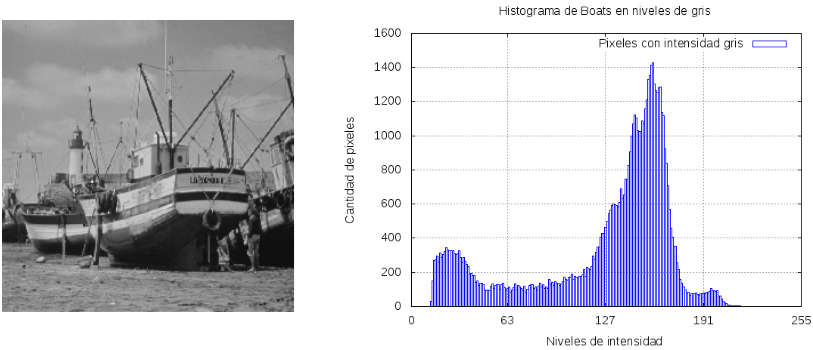

# pdiHistograma



Crea un *array* que representa un [histograma de imagen](https://en.wikipedia.org/wiki/Image_histogram) dicho histograma típicamente se representa mediante la siguiente expresión:


donde *h* es la *función* histograma, *k* es el nivel de intensidad y *n* es el número de pixeles con intensidad *k*.

A continación se describe brevemente las funciones de `pdiHistograma`.

**Nota:** Para este programa se usó [OpenCV](https://opencv.org/) y [gnuplot](http://www.gnuplot.info/), este último software no es tan importante.

## pdiHistograma

Esta función esta declarada como:

`void pdiHistograma(int histograma[], Mat imagen, int nivelesDeIntensidad)`

donde:
* `int histograma[]`
Es un *array* donde se va a almacenar el número de pixeles, el nivel de intensidad esta dado por el *índice del array*, el tamaño de este *array* debe ser el mismo que `int nivelesDeIntensidad`.

* `Mat imagen`
Es la imagen de la que se obtendrá el histograma abierta en escala de grises.

* `int nivelesDeIntensidad`
Son el total de niveles de intensidad que pueden ser almacenados en la imagen, por ejemplo, en escala de grises en 8 bits hay 256 niveles de intensidad.

Esta función esta limitada a trabajar con imágenes a escala de grises de 256 niveles de intensidad.

## gnuplotear

Gráfica el histograma y la exporta a un archivo de imagen con extensión *.png*.

`void gnuplotear( int n_i[ ], int nivelDeIntensidad, char id[])`

donde:
* `int n_i[ ]`
Es el histograma que se quiere graficar

* `int nivelesDeIntensidad`
Son el total de niveles de intensidad que pueden ser almacenados en la imagen, por ejemplo, en escala de grises en 8 bits hay 256 niveles de intensidad.

* `char id[ ]`
Es el nombre de la imagen que se carga para dar como entrada al programa **pero sin la extención de archivo** ni caracteres raros de tipo: signos de puntación o acentuaciones ya que gnuplot podría dar error.
En sistemas *Unix* mediante la linea de comandos se puede dar como parámetro al programa dicho nombre sin extención cuando se **ejecuta** el programa (después de compilar) de la siguiente manera:

```bash
#compilar

g++ mainHistograma.cpp pdiHistograma.cpp pdiHistograma.h -o mainHistograma `pkg-config --cflags --libs opencv`

#ejecutar
./mainHistograma boats.tif boats

```

Para usar esta función se necesita tener instalado [gnuplot](http://www.gnuplot.info/) como programa, no como librería ya que `void gnuplotear`se comunica con este programa mediante un apuntador de tipo `Pipe`.

Esta función esta limitada a trabajar con imágenes a escala de grises de 256 niveles de intensidad.

No empieza con `pdi` porque no es una función de procesamiento digital de imágenes, se limita a graficar
