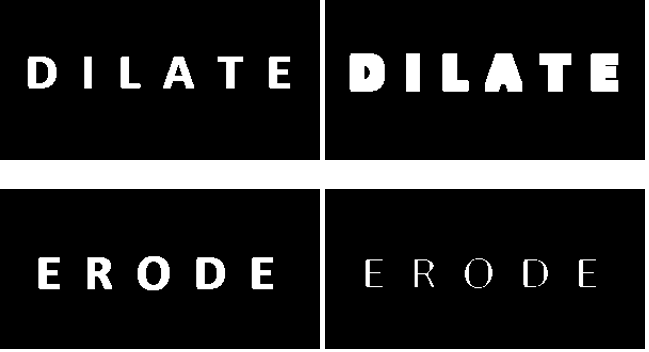

# pdiMorfologicas



Contienen las [operaiones morfológicas:]( https://en.wikipedia.org/wiki/Mathematical_morphology ) erosión (`pdiErode`) y dilatación (`pdiDilate`) para imágenes binarias, además de usos para ambas operaciones como [*Open*](https://en.wikipedia.org/wiki/Opening_(morphology)), [*Close*](https://en.wikipedia.org/wiki/Closing_(morphology)) y obtener el contorno.

A continuación se describe brevemente las funciones de `pdiMorfologicas`.

**Nota:** En este código se usó [OpenCV](https://opencv.org/).

## pdiErode

Recorre la imagen con una **ventana de 3x3** llena de 255 (blanco), buscando el primer caso para el cual al hacer la operación lógica *AND* con la imagen de como resultado 0 (falso), entonces pone en el pixel central de la ventana de 3x3 de la imagen un 0 (erosiona) y la ventana continúa recorriendo la imagen haciendo la operación *AND*.

`pdiErode` está decalrado como
`void pdiErode( Mat erosionada )`
donde:

* `Mat erosionada` es la imagen que va a ser erosionada.

La erosión modifica la imagen original. Si se necesita la imagen orignal sin cambios se puede hacer lo siguiente:

 ```c++
 imagenOriginal = imread("ERODE.tif", 0);
 Mat imagenClonada = imagenOriginal.clone();
 pdiErode(imagenClonada);
```

## pdiDilate

Recorre la imagen con una **ventana de 3x3** llena de 0 (negro), buscando el primer caso para el cual al hacer la operación lógica *OR* con la imagen de como resultado 255 (verdadero), entonces pone en el pixel central de la ventana de 3x3 de la imagen un 255 (dilata) y la ventana continúa recorriendo la imagen haciendo la operación *OR*.

`pdiDilate` está decalrado como
`void pdiDilate( Mat dilatada )`
donde:

* `Mat dilatada` es la imagen que va a ser dilatada.

La dilatación modifica la imagen original. Si se necesita la imagen orignal sin cambios se puede hacer lo siguiente:

 ```c++
 imagenOriginal = imread("DILATE.tif", 0);
 Mat imagenClonada = imagenOriginal.clone();
 pdiDilate(imagenClonada);
```


# Algunos usos para *pdiErode* y *pdiDilate*

## Funciones *open* y *close* mediante *erode* y *dilate*

La función [*open*](https://en.wikipedia.org/wiki/Opening_(morphology)) es la dilatación de la erosión en una imagen (típicamente binaria), se puede construir `pdiOpen` como:

```c++
void pdiOpen(Mat imagen){
    pdiErode( imagen );
    pdiDilate( imagen );
}
```

La función [*close*](https://en.wikipedia.org/wiki/Closing_(morphology)) es la erosión de la dilatación en una imagen (típicamente binaria),  se puede construir `pdiClose` como:

```c++
void pdiClose(Mat imagen){
    pdiDilate( imagen );
    pdiErode( imagen );
}
```
*Open*, *close*, *erode* y *dilate* sirven para remover el objetos pequeños y rellenar huecos en un objeto en la imagen.

## Obtener el contorno de una imagen

Para obtener el contorno con erosión y dilatación. Se le resta a la imagen original la imagen erosionada. También se puede restar a la imagen dilatada la imagen original.


Enseguida se muestran las dos opciones para obtener el contorno.

`pdiContornoErode` está definido como

`void pdiContornoErode( Mat imagen, Mat imagenContorno )`
donde:

* `Mat imagen` es la imagen a la que se le obtendrá el contorno.

* `Mat imagenContorno` es la imagen dónde se guardará el contorno.

`pdiContornoDilate` está definido como

`void pdiContornoDilate( Mat imagen, Mat imagenContorno )`
donde:
* `Mat imagen` es la imagen a la que se le obtendrá el contorno.

* `Mat imagenContorno` es la imagen dónde se guardará el contorno.
